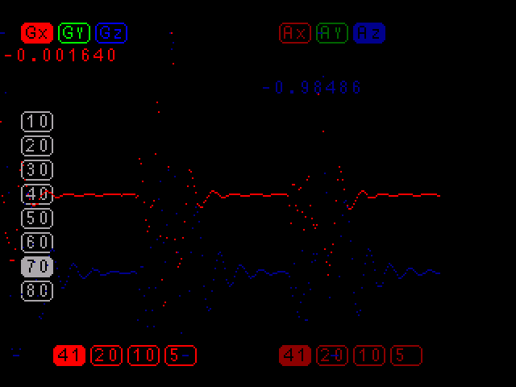

# ICM-20602 LCD demo

This folder contains a demonstration program showcasing the functionality
of a accelerometer and gyro sensor using the STM32 F4VE board
and an LCD display included in the kit. The program features a straightforward
graphical user interface (GUI) for configuring sensor parameters.

## Overview

The demonstration program is designed to work with the STM32 F4VE development
board and a compatible LCD display. It provides a GUI interface to configure
sensor parameters such as filter bandwidth, output data rate divider, etc.
The display includes buttons for enabling/disabling the display of
gyro measurement (Gx, Gy, Gz), acceleration (Ax, Ay, Az). Additionally,
there are buttons (`41`, `20`, `10`, `5` Hz) next to each measurement for
controlling the filter's bandwidth. Additionally, grey buttons labeled `10`,
`20` .. `80` (Hz) adjust the output data rate.

## Requirements

* STM32 F4VE development board
* Any ICM-20602 module
* Compatible LCD display/touch panel included in the kit
* Development environment compatible with STM32F4 microcontrollers

## Setup

* Attach ICM-20602 by I2C to PB9 (SDA), PB8 (SCL)
* Attach the LCD display to the designated port on the STM32F4VE board.
* Connect the STM32 F4VE board to your development environment.

## Usage

Compile and upload the program to the STM32 F4VE board. Upon successful upload,
the demonstration program will run, displaying sensor data on the LCD screen.
Activate the buttons on the GUI interface using the touch panel.
Simply touch the corresponding button on the LCD screen to toggle its state.
